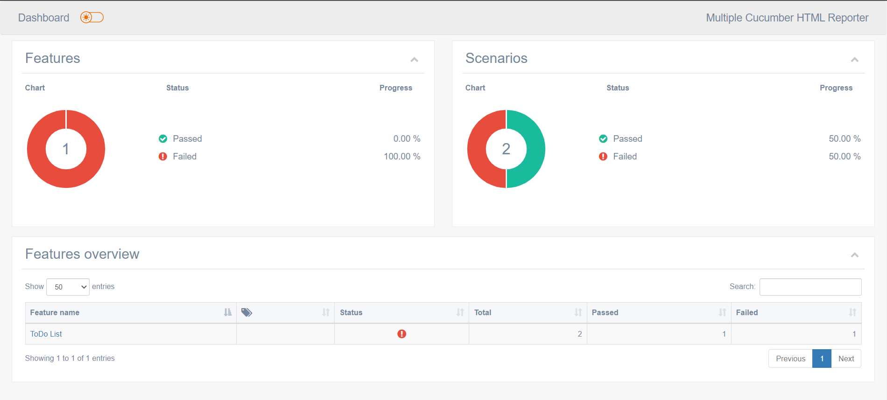
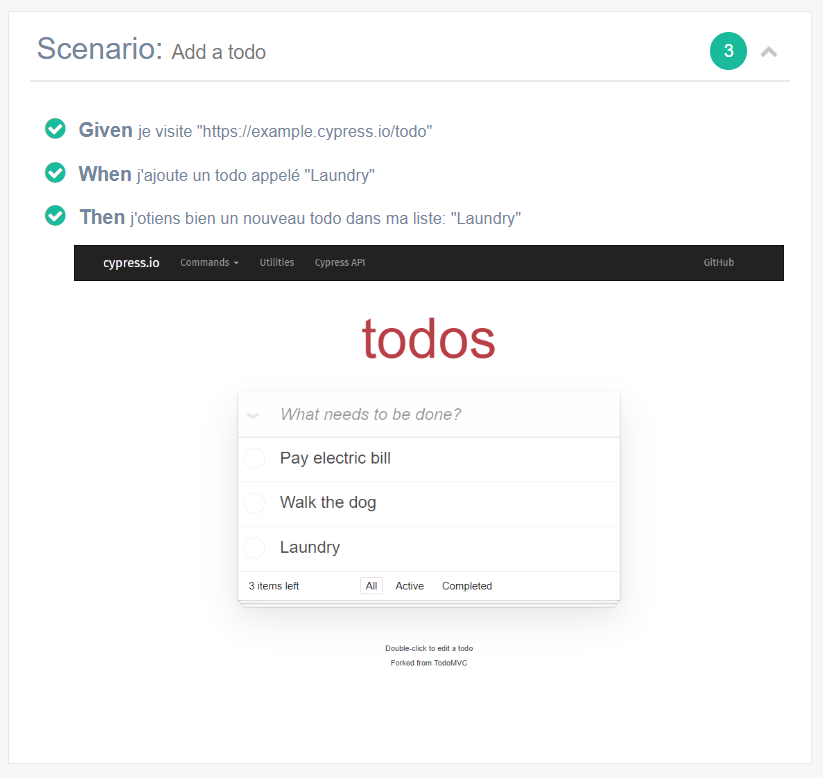
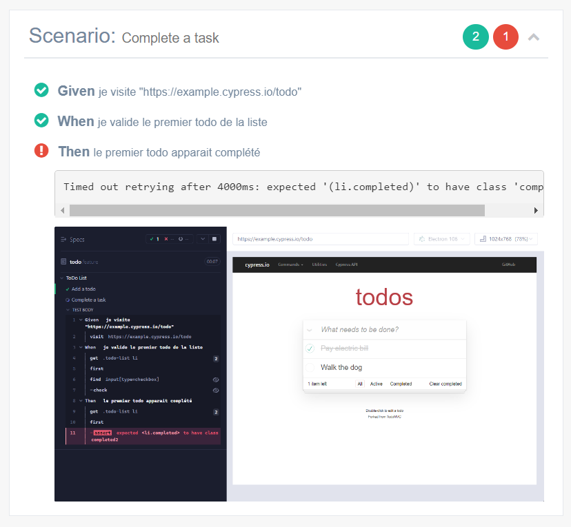

# Cypress Starter Kit

[Cypress](https://www.cypress.io) is an alternative to [Selenium](https://www.selenium.dev/) and allows you to write simple, fast, and reliable tests. It aims to simplify the setup of integration or end-to-end tests, which can often be quite complex.

This repository aims to create integration and end-to-end tests for a project. It uses the `cypress-component` package because it simplifies access to the HTML elements used in your test files. It allows you to navigate through the application in a more functional way and enter the desired data exactly as you would in your browser. You can then make assertions to ensure that the application behaves as expected.

## Why Cypress?

Cypress works completely differently from other testing tools. Cypress runs directly inside the browser, unlike Selenium, which runs outside of a browser and uses the network to send commands to a remote server. Additionally, it uses a Node.js server that can directly respond to application events. It also allows you to modify network traffic and modify the content of an HTTP response.

Its installation is extremely simple as it runs locally.

## Prerequisites

To be able to use Cypress, you will need:

- Node.js: [https://nodejs.org/en/download/](https://nodejs.org/en/download/)
- NPM: It should be installed along with Node.js
- VS Code (optional): [https://code.visualstudio.com/download](https://code.visualstudio.com/download)

Installation guide: [https://phoenixnap.com/kb/install-node-js-npm-on-windows](https://phoenixnap.com/kb/install-node-js-npm-on-windows)

## Installation

- Clone the repository using git into a new folder (e.g., integration-tests)
- At the root, run the command `npm i`

> 💡 Tips: Create a separate folder at the same level as your application. Avoid mixing your tests written in Cypress with your source code. It is preferable to have a separate NPM project in a distinct folder (ideally at the same level as your application).

Example:

```text
-Sources/
--client/
---client-app/ <- your appplication
----src/
----package.json
---integration-tests/ <- your tests folder
--sever/
---...
```

- In the root folder, execute the following: `npm i`

## Launching

At the root, run one of the following commands:

- `npm start`: to launch the tests in the Cypress tool
- `npm test`: to launch the tests in headless mode
- `npm run cucumber`: to launch the tests written in Gherkin
- `npm run livedoc`: to generate the living documentation

> 💡 Tips: If you want to run your tests locally, you can combine a script to start your application and another script to run Cypress using the [`start-server-and-test`](https://github.com/bahmutov/start-server-and-test) package. This package will launch your application locally and wait for your server to respond before executing your tests.

### Exemple

```json
// package.json
    //...
    "scripts": {
        "start": "start-server-and-test app:run 3000 cypress:open",
        "app:run": "cd ../client-app && npm start",
        "cypress:open": "cypress open",
    },
    //...
```

## Documentation

### Cypress Component

Cypress Component aims to facilitate the reading and writing of Cypress tests. It improves the accessibility of DOM elements through a component-based approach, similar to modern web frameworks. It also facilitates the management of routes, whether in a mocked or non-mocked environment.

> Documentation: [`cypress-component`](https://github.com/AxaFrance/cypress-component)

Component declarations are done in the `cypress/components` folder.

#### Components example

```ts
// todo.ts

import { Button, HtmlElement, TextInput } from "@axa-fr/cypress-component";

export const TodoCard = {
  addTodoInput: TextInput('input[data-test="new-todo"]'),
  items: HtmlElement(".todo-list li"),
  footer: {
    completedFilterButton: Button({
      selector: "footer a",
      contains: "Completed",
    }),
  },
};
```

Cypress-component alos facilitates [routes](https://docs.cypress.io/guides/guides/network-requests) managment. You can define them in the file `cypress/common/routes.ts.`

#### Routes declaration example

```ts
// routes.ts

import {
  HttpMethod,
  RoutesDefinition as RouteDef,
} from "@axa-fr/cypress-component";

export const Routes = {
  profile: "PROFILE",
  // other routes...
};

export const RoutesDefinition: RouteDef = {
  [Routes.profile]: {
    httpMethod: HttpMethod.GET,
    urlPattern: "/api/profile",
    defaultStub: {
      body: {
        sub: "q7NeegECCYxD4J97jzSv7BKsEtv1/YUT2gLbSnbXYfQ=",
        family_name: "PROVIS",
        gender: "unknown",
        given_name: "Pirlouit",
        name: "PROVIS Pirlouit",
        updated_at: 1665581718,
      },
    },
  },
  // other route defintions...
};
```

### Cypress Tests

In this project, you can write tests in Cypress or Gherkin. The Cypress tests are located in the `cypress/e2e` folder. A test written in Cypress has the format `[testName].cy.ts`.

#### Example of Cypress Test using cypress-component

> See more: [`cypress-component`](https://github.com/AxaFrance/cypress-component)

```ts
describe("To do", () => {
  beforeEach(() => {
    Browser.visit("https://example.cypress.io/todo");
  });
  it("should add a todo", () => {
    TodoCard.addTodoInput.set("Laundry");

    TodoCard.items.should((items) => {
      expect(items).to.have.length(3);
    });
    TodoCard.items.last().should((lastItem) => {
      expect(lastItem).to.have.text("Laundry");
    });
  });
  it("should complete a task", () => {
    TodoCard.items.first().find("input[type=checkbox]").check();

    TodoCard.items.first().should((item) => {
      expect(item).to.have.class("completed");
    });

    TodoCard.footer.completedFilterButton.click();

    TodoCard.items.should((items) => {
      expect(items).to.have.length(1);
    });
    TodoCard.items.first().should((firstItem) => {
      expect(firstItem).to.have.text("Pay electric bill");
    });
  });
});
```

> Fore more examples check `cypress/e2e/examples`

### Tests in Gherkin

The tests written in Gherkin are located in the `cypress/e2e/features` folder. The Gherkin tests are organized in folders named after the feature, with a `[featureName].feature` file inside and step implementations in `[featureName].ts`. You can also implement shared steps between different features in the `cypress/support/step_definitions` folder.

The compatibility of Gherkin scenarios with Cypress is ensured by the [@badeball/cypress-cucumber-preprocessor](https://github.com/badeball/cypress-cucumber-preprocessor) package.

#### Example of a feature and its implementation

```feature
# todo.feature

Feature: ToDo List

    Scenario: Add a todo
        Given I visit "https://example.cypress.io/todo"
        When I add a todo called "Laundry"
        Then I should see a new todo in my list: "Laundry"

    Scenario: Complete a task
        Given I visit "https://example.cypress.io/todo"
        When I complete the first todo in the list
        Then the first todo should appear as completed
```

```ts
// todo.ts

import { Given, Then, When } from "@badeball/cypress-cucumber-preprocessor";
import { Browser } from "@axa-fr/cypress-component";
import { TodoCard } from "../../../common/components/todos";

Given("I visit {string}", (url: string) => {
  Browser.visit(url);
});

When("I add a todo called {string}", (todo: string) => {
  TodoCard.addTodoInput.set(todo);
});

When("I complete the first todo in the list", () => {
  TodoCard.items.first().find("input[type=checkbox]").check();
});

Then("I should see a new todo in my list: {string}", (todo: string) => {
  TodoCard.items.should((items) => {
    expect(items).to.have.length(3);
  });
  TodoCard.items.last().should((lastItem) => {
    expect(lastItem).to.have.text(todo);
  });
});

Then("the first todo should appear as completed", () => {
  TodoCard.items.first().should((item) => {
    expect(item).to.have.class("completed");
  });
}); 
```

> For more information, refer to [`@badeball/cypress-cucumber-preprocessor`](https://github.com/badeball/cypress-cucumber-preprocessor). For additional features, please check the `cypress/e2e/features` folder.

### Living Documentation

After running your integration tests using the `npm run cucumber` command, you can generate living documentation using the `npm run livedoc` command. The documentation can be found in the `cypress/reports/cucumber-html` folder.

> 💡 Note: To enable this feature, a JSON formatter is located in the `/reporters` folder (two versions available: one for Windows and one for Linux). More information can be found [here](https://github.com/badeball/cypress-cucumber-preprocessor/blob/master/docs/json-report.md).

The generated report has the following structure:



Here, you can find the different features. Clicking on a feature will display detailed scenarios.

<table border="0">
    <thead>
        <th>Example of a successful scenario</th>
        <th>Example of a failed scenario</th>
    </thead>
    <tr>
        <td></td>
        <td></td>
    </tr>
</table>

## Contribute

- [How to run the solution and contribute](./CONTRIBUTING.md)
- [Please respect our code of conduct](./CODE_OF_CONDUCT.md)
